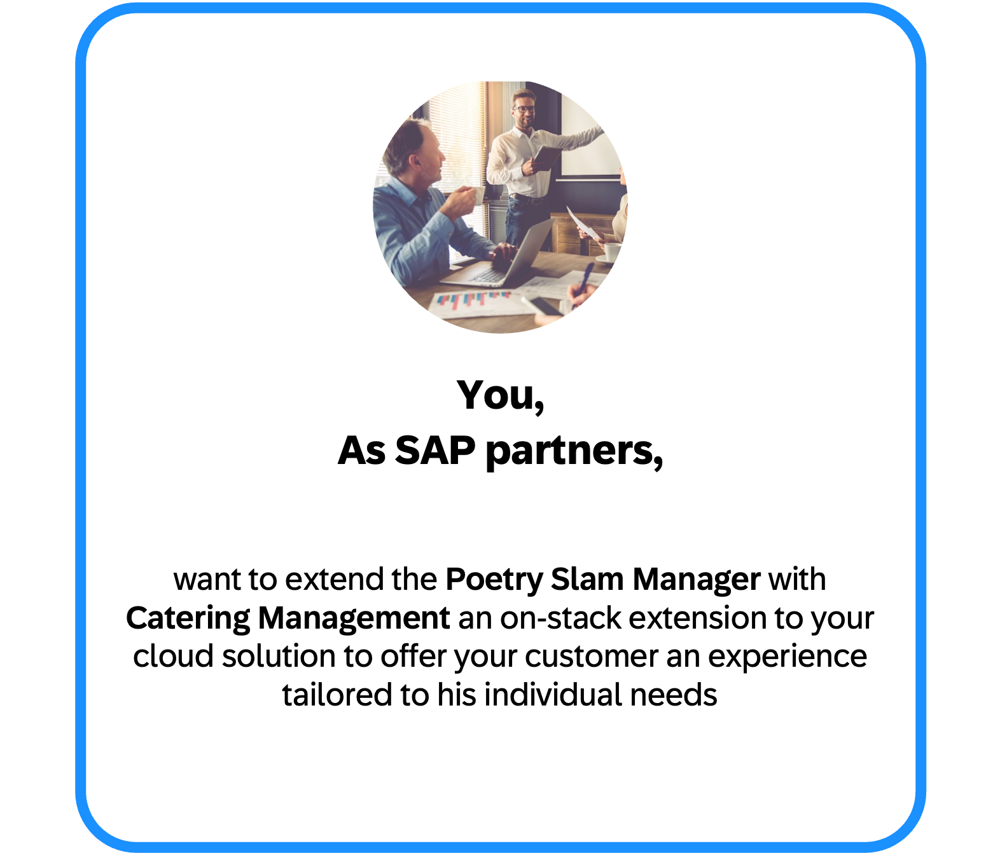
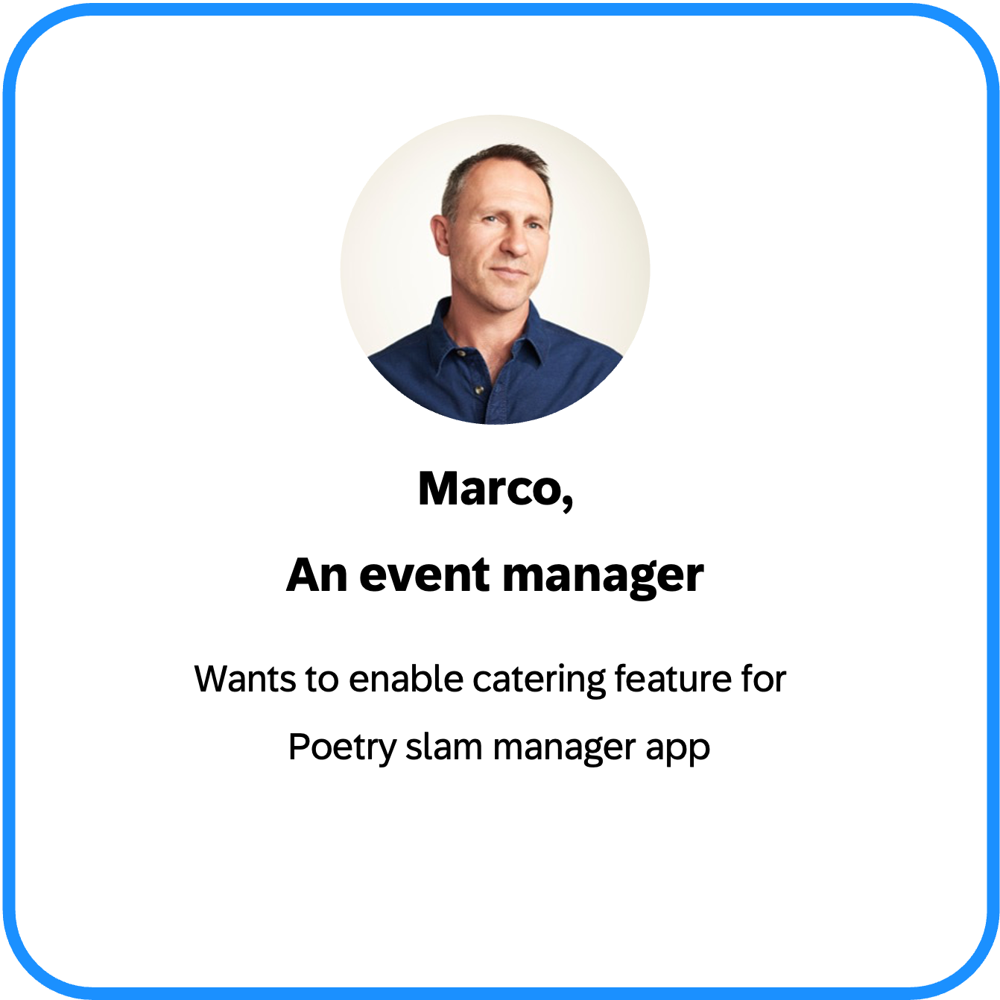
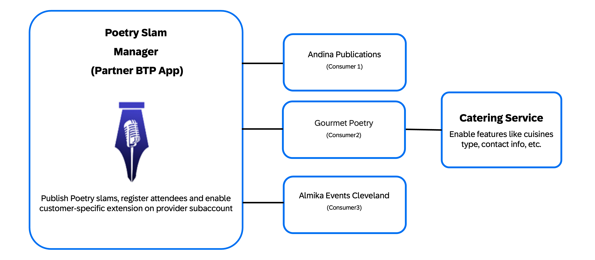
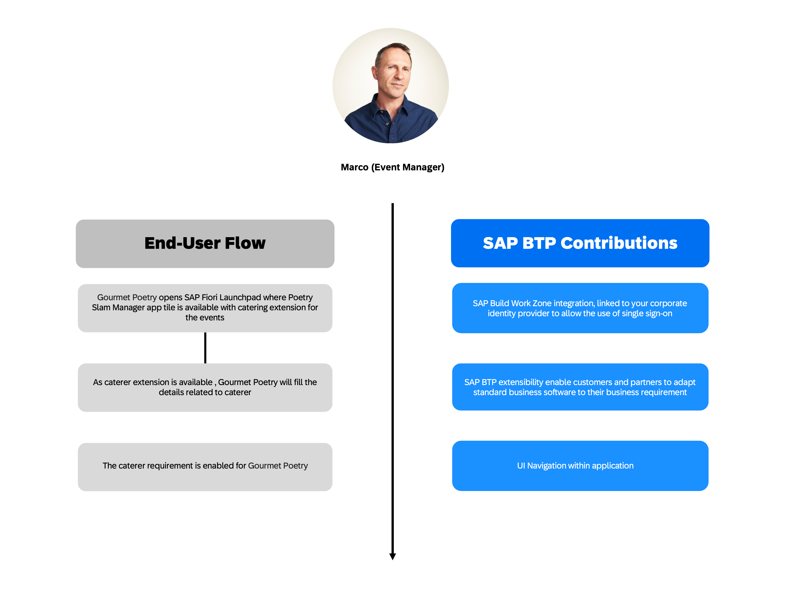

# Partner Reference Application Extension 'Catering Management'

## Description

In the dynamic landscape of multi-tenant SaaS applications, extensibility is crucial for success. While standardized cloud software offers efficiency and regular updates, it often can't address every customer's unique needs, industry-specific requirements, or regulatory demands. When one customer requires a specialized feature, it's impractical to modify the core product for all users. Moreover, businesses need the flexibility to integrate with existing systems, innovate on top of standard solutions, and rapidly adapt to changing market conditions—all while maintaining a cost-effective approach that preserves the ability to receive regular software updates. This is where tenant-specific extensions become invaluable.

The Partner Reference Application Extension repository demonstrates how to achieve this crucial flexibility by extending the [Poetry Slam Manager](https://github.com/SAP-samples/partner-reference-application.git) with enhanced catering management capabilities. By leveraging the SAP Business Technology Platform (SAP BTP) and the SAP Cloud Application Programming Model (CAP), this extension acts as a "golden path" for partners. It enables partners to build extensions that address the unique needs of individual customers while preserving the core application's functionality for other tenants and adhering to SAP standards for scalability, security, and enterprise readiness.

It showcases the platform's flexibility and extensibility with features such as:

- Seamless integration with the base application,
- Granular tenant-specific configurations to deliver personalized experiences,
- Consistent user experience across extended and core functionality,
- Secure multi-tenant architecture, ensuring data isolation and performance scalability.

      

#### Overview of Partner Reference Application

[Partner Reference Application](https://github.com/SAP-samples/partner-reference-application.git) repository provides you with a “golden path” to becoming a SaaS provider of 
multi-tenant applications based on SAP BTP. The guidance covers building, running, and integrating scalable full-stack cloud applications. 
It includes an ERP-agnostic design that lets you deliver your application as a side-by-side extension to consumers using any SAP solution, such as SAP S/4HANA Cloud, SAP Business One, 
and SAP Business ByDesign.

### About the Sample Extension _Catering Management_

Imagine you are an event manager at Gourmet Poetry, a company renowned for organizing high-profile poetry slams that seamlessly blend spoken word artistry with gourmet catering experiences.

While the base Poetry Slam Manager (PSM) application helps you manage events and attendees, you face additional complexities in selecting, tracking, and coordinating with caterers for your events.

Here, the event manager needs to organize catering for events registered in the "Poetry Slam Manager" app and therefore uses the extension provided by the partner to manage catering services.

      

While Gourmet Poetry sees catering as an essential component of their events, other customers may not require this functionality. The extension is designed to accommodate both scenarios seamlessly,
enabling tenant-specific configurations without disrupting the core application's functionality for other users.

This story highlights:

- The flexibility of multi-tenant architecture, ensuring optional features like catering can be enabled per tenant.
- The power of SAP BTP extensions to address niche business needs without impacting core functionality.
- An innovative example of blending technology with the art of event management in the culinary and poetry domains.

The Catering Management Extension provides:

1. Dedicated UI for Caterer Management:
    - Manage a directory of preferred caterers with details such as contact information, cuisine specialties, and pricing.
    - Search, filter, and select caterers based on event requirements.
    - Integration with Poetry Slam Events:

2. Assign caterers to specific events and manage catering logistics directly in the application.

This extension ensures a unified experience for managing both poetry slams and gourmet catering, allowing you to elevate event quality while streamlining operational workflows.

      

The sample showcases how a side-by-side application benefits from using SAP BTP. The qualities relevant for enterprise-grade partner applications, supported by SAP BTP services and programming models are outlined in the image below.

      

### Features

#### Scope

The objective of this repository is to develop an extension that enhances the existing Poetry Slam Manager, allowing partners to incorporate customer-specific features such as customization of various user interface (UI) components and expanding the application's service capabilities.
The key deliverables and scope of the project include:

- Customer-specific fields and features:

    These fields are added within the existing UI and can be edited by the customer. They are integrated seamlessly into the core application's functionality, ensuring consistency and user convenience. Enable extension fields to the existing UI so that they can be edited in the context of the core application.

- Enhancements to the existing UI to accommodate new fields and features:

    Creation of customer-specific entities to existing services with new customer-specific UI to manage customer-specific entities.

#### Functionality

- Caterer Assignment: Assign caterers to specific poetry slam events and track their bookings.
- Caterer Data Management: View, add, and manage caterer information, including contact details, cuisine specialties, and availability.

## Requirements

The application is based on SAP BTP and SAP ERP solutions. Therefore, here's what you need:

- A SAP BTP account, which includes SAP Business Application Studio as a standardized development environment,
- GitHub as your code repository,
- a SAP ERP system and
- a fully deployed [Partner Reference Application](https://github.com/SAP-samples/partner-reference-application.git) in a provider account and a subscriber account.

To get a more detailed list of the required entitlements, the proposed structure of subaccounts for the deployed Partner Reference Application, and the scaling effects of the multi-tenant solution, go to the [Bill of Materials](./Tutorials/01-BillOfMaterials.md).

## Tutorials

Add additional features and capabilities to the Poetry Slam Manager application to meet customer-specific requirements by leveraging on-stack extensions.

1. [To jump straight into deploying the extension application, refer to the Quick Start Guide.](./Tutorials/05-Quickstart.md)
2. [Learn about extensibility and get an overview of bill of materials](./Tutorials/01-BillOfMaterials.md)
3. [Extend the data model to include custom entities and fields](./Tutorials/02-DataModelExtensibility.md)
4. [Develop a Fiori UI to manage the custom entity.](./Tutorials/03-FioriUIForExtendedEntity.md)
5. [Go on a guided tour to explore the capabilities of the sample extension](./Tutorials/04-GuidedTour.md)

## More Information

i.   [Partner Reference Application](https://github.com/SAP-samples/partner-reference-application)

ii.  [Capire extensibility documentation](https://cap.cloud.sap/docs/guides/extensibility/)

## Known Issues

  There aren't any known issues.

## Get Support

This repository is provided "as-is", we don't offer support. For questions and comments, [join the SAP Community](https://community.sap.com/t5/forums/postpage/category-id/products/choose-node/true).

## License

Copyright (c) 2025 SAP SE or an SAP affiliate company. All rights reserved. This project is licensed under the Apache Software License, version 2.0 except as noted otherwise in the [LICENSE](https://github.com/SAP-samples/partner-reference-application-extension/blob/main/LICENSE) file.

## Disclaimer

This repository contains sample code provided “as‑is” for instructional purposes only. SAP makes no warranties and accepts no liability, except in cases of gross negligence or willful misconduct. All included data is fictitious and contains no real personal, confidential, or sensitive information. Do not use this tutorial app productively with real personal data. SAP is not responsible if anyone uses it to capture personal data.
