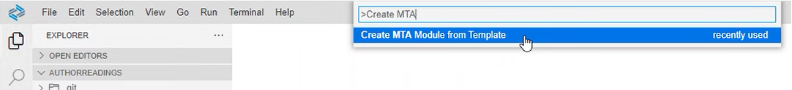

# SAP Fiori UI for Extended Entity

As an extension developer working with a customer like Gourmet Pages, imagine the need to create a specialized SAP Fiori UI for managing their catering services—something not available in the standard Poetry Slam Manager (PSM) application. This tutorial demonstrates how to achieve that using SAP BTP’s extensibility capabilities. By developing an extension application, you can introduce a custom UI for Gourmet Pages without modifying the core PSM application, ensuring data remains isolated and secure within their own tenant by leveraging BTP’s multi-tenancy features. This approach not only provides Gourmet Pages with a tailored solution but also allows the core PSM application to remain stable while enabling partners like you to deliver valuable, differentiated functionality.

Building on the previous tutorial, [Data Model Extensibility](./02-DataModelExtensibility.md), where you extended the PSM data model with the *x_Caterers* entity, this tutorial will now guide you in creating a corresponding Fiori UI to efficiently manage this data for Gourmet Pages.

## Get Poetry Slam Manager EDMX

You consume the metadata of the *Poetry Slams* OData service from the subscriber subaccount, where the backend is independently managed. This metadata is then utilized to create the Fiori project. To obtain the metadata, follow the steps outlined below:

1. Copy the poetry slams application url from the subscriber subaccount.

    i. In the SAP BTP cockpit of the subscriber subaccount, navigate to *Instances and Subscriptions* in the *Services* section.

    ii. Copy the url of the *Poetry Slam Manager* application on the *Subscription* tab.

2. Open any web browser, such as *Google Chrome*, and enable the *Developer Tools*.

    > Note: You can enable *Developer Tools* in *Google Chrome* using a keyboard shortcut:
    >
    > i. Windows/Linux: Press `Ctrl + Shift + I` or `F12`.  
    > ii. Mac: Press `Cmd + Option + I`.

3. Paste the application URL into the browser's address bar and press *Enter*.

4. In the *Network* tab's filter bar, type `metadata` to filter the requests related to the metadata.

5. Copy the response of the metadata API call.

6. Create a new file (e.g. poetryslam.edmx) in your extension project and paste the metadata.

## Add a Web Application with SAP Fiori Elements

You create the Fiori project by uploading the metadata using the *SAP Fiori Elements Application Wizard*.

1. To start the wizard, search for *Create MTA Module from Template* in the *Command Palette...*.

   

2. Select the *SAP Fiori Generator* module template. 
3. Choose *List Report Page*.
4. Select the data source and the OData service as follows:
   - *Data source*: *Upload a Metadata Document*
   - *Metadata file path*: *Upload the metadata file created in the previous section*
5. Select the main entity from the list:
   - *Main entity*: *x_Caterers*
   - *Automatically add table columns*: *Yes*
6. Add further project attributes:
   - *Module name*: *caterer*
   - *Application title*: *Caterers*
   - *Application namespace*: leave empty
   - *Description*: *Application to create and manage caterers*
   - *Enable Typescript*: *Yes*
   - *Add deployment configuration*: *Yes*
   - *Add FLP configuration*: *No*
   - *Configure Advanced Options*: *No*
7. Select the deployment configuration:
   - *Please choose the target*: *Cloud Foundry*
   - *Destination name*: *none*
   - *Add application to managed application router*: *Yes*
8. Select the Fiori settings:
   - *Smart Variant Management*: *Use Page Variant*
   - *Layout*: *Standard Layout*
   - *Table Type*: *Responsive*
   - *Selection Mode*: *Single*
9. Select the CI/CD settings:
   - *Translation Domain*: leave empty
   - *Translation Developer*: leave empty
   - *Translation Collection*: leave empty
   - *Fiori ID*: *caterer*
   - *Application Component Hierarchy*: *pre-cat*
10. Choose *Finish*. The wizard creates the *caterer* folder, which contains all files related to the user interface.

## Fine-Tune the User Interface

Creating the extension UI follows the same process as developing the standard UI for the PSM application. To customize the generated user interface to meet specific requirements, you can either leverage the [SAP Fiori Tools - Application Modeler extension](https://help.sap.com/docs/SAP_FIORI_tools/17d50220bcd848aa854c9c182d65b699/a9c004397af5461fbf765419fc1d606a.html?locale=en-US) for a guided, low-code approach or manually modify the generated files for greater flexibility and control.

The SAP Fiori Tools - Application Modeler extension includes two tools, which are helpful when creating new pages or adjusting existing ones:

- [Page Editor](https://help.sap.com/docs/SAP_FIORI_tools/17d50220bcd848aa854c9c182d65b699/047507c86afa4e96bb3d284adb9f4726.html?locale=en-US): Create and maintain annotation-based UI elements.
- [Page Map](https://help.sap.com/docs/SAP_FIORI_tools/17d50220bcd848aa854c9c182d65b699/bae38e6216754a76896b926a3d6ac3a9.html?locale=en-US): Change the structure of pages and application-wide settings.

> Note: The recommendation is to use the SAP Fiori tools to create new pages or to enhance existing ones with additional features as the tools generate the required annotations in the annotations file. For better readability, you can restructure the annotations afterwards.

This tutorial will not go into a line-by-line explanation of the files. However, you are encouraged to explore each file in detail to gain a deeper understanding of the sample implementation. The most relevant files are the following:

- [`package.json`](../partner-reference-extension-catering-ui/caterer/package.json): The *-SNAPSHOT* suffix in the version indicates that the generated SAP Fiori application is in the development stage and not yet a final release. It serves as a marker for ongoing development, enabling iterative testing and improvements. Before deploying the application, ensure that the -SNAPSHOT suffix is removed to reflect a stable, finalized version. Add the scripts to build and deploy the application.
- [`index.html`](../partner-reference-extension-catering-ui/caterer/webapp/index.html): Define the appearance of the first UI of your application that is opened using a managed app router.
- [`manifest.json`](../partner-reference-extension-catering-ui/caterer/webapp/manifest.json): Describe the application structure, routing, services, dependencies, and SAP Fiori launchpad integration.
- [`annotation.xml`](../partner-reference-extension-catering-ui/caterer/webapp/annotations/annotation.xml): Define UI-specific annotations that dictate how data is displayed and behaves in the SAP Fiori application.

## Add Destination Route to App Router

To ensure secure and tenant-isolated communication between the new SAP Fiori application and the core PSM OData service, all requests from the SAP Fiori application must be properly routed. This is achieved by configuring the routing rules in the [xs-app.json](../partner-reference-extension-catering-ui/caterer/xs-app.json) file. By doing so, requests to the core *Poetry Slams* OData service are securely handled, maintaining tenant isolation and enforcing controlled access while seamlessly integrating the extension with the core application.

```json
{
    "source": "^/odata/v4/poetryslamcaterer/(.*)$",
    "target": "/odata/v4/poetryslamservice/$1",
    "destination": "poetry-slams-caterer",
    "authenticationType": "xsuaa",
    "csrfProtection": true
}
```

| **Property**              | **Description** |
|---------------------------|----------------|
| **source** | Defines the pattern for incoming requests. Any request that starts with `/odata/v4/poetryslamcaterer/` is matched, and the `(.*)` dynamically captures the remaining part of the request URL. This pattern ensures that all relevant requests are correctly routed. Additionally, this URI is specified as the main service URI in the [manifest.json](../partner-reference-extension-catering-ui/caterer/webapp/manifest.json) file, ensuring seamless integration with the SAP Fiori application. |
| **target** | Rewrites the incoming request URL to this new target path. The `$1` placeholder refers to the captured portion from the `source`, ensuring that the rest of the request path remains intact. |
| **destination** | Specifies the backend service or system to which the request should be forwarded. This is typically configured in the SAP BTP Destination Service, enabling seamless connectivity between the SAP Fiori application and the backend system. In the upcoming sections, you will create and configure this destination. |
| **authenticationType** | Enforces authentication using *SAP BTP XSUAA (SAP Authorization and Trust Management Service)* to ensure secure access control. |
| **csrfProtection** | Enables *Cross-Site Request Forgery (CSRF) protection* for this route. |

## Service Broker Setup

To access the *Poetry Slams* OData services from your SAP Fiori application, you must use the service broker. The service broker enables secure access to application OData services by utilizing tenant-specific credentials and authorizations, ensuring effective tenant isolation in a multi-tenant application environment.

> Note: A service broker should be added to your PSM application to enable seamless integration and access to the required services. For more details, refer to the [Partner Reference Application Tutorial - Enable API Access to SAP BTP Applications Using Service Broker](https://github.com/SAP-samples/partner-reference-application/blob/main/Tutorials/42a-Multi-Tenancy-Service-Broker.md#enable-api-access-to-sap-btp-applications-using-service-broker).

You need to configure the service broker in your subscriber subaccount to access the *Poetry Slams* OData services. For more details, refer to the [Partner Reference Application Tutorial - Configure the Service Broker in a Consumer SAP BTP Subaccount](https://github.com/SAP-samples/partner-reference-application/blob/main/Tutorials/42b-Multi-Tenancy-Provisioning-Service-Broker.md#configure-the-service-broker-in-a-consumer-sap-btp-subaccount).

## Create the Destination

You need to create a destination in the subscriber subaccount to connect to the *Poetry Slams* OData service using the service broker instance. This destination is already configured in the [xs-app.json](../partner-reference-extension-catering-ui/caterer/xs-app.json) file to enable tenant-specific data calls.

- *Name*: *poetry-slams-caterer*
- *Type*: *HTTP*
- *URL*: Get the URL of the application service from the provider subaccount.
   1. In the SAP BTP cockpit of the provider subaccount, navigate to the SAP BTP Cloud Foundry runtime space where the application is deployed.
   2. In the space cockpit, navigate to *Applications* and choose the link *poetry-slams-srv*.
   3. Copy the *Application Route* from the *Application Overview* for later use (**provider service URL**).
- *Proxy Type*: *Internet*
- *Authentication* - *OAuth2UserTokenExchange*
- *Token Service URL* - `https://<SUBSCRIBER-SUBDOMAIN>.authentication.eu12.hana.ondemand.com/oauth/token`
   1. Get the subdomain from the subscriber subaccount.

      i. In the SAP BTP cockpit of the subscriber subaccount, navigate to *Overview*.

      ii. Copy the *Subdomain* from the *General* section.

- *Client Id* and *Client secret* - Get the client id and client secret from the service key of the service broker instance created in the subscriber subaccount.
   1. In the SAP BTP cockpit of the subscriber subaccount, navigate to the SAP BTP Cloud Foundry runtime space where the service broker instance is created.
   2. Get the *client id* and *client secret* from the service key of service broker instance.
- *Token Service URL Type* - *Dedicated*

> Note: For more information on *HTTP Destinations*, refer to the [SAP BTP Connectivity - HTTP Destinations](https://help.sap.com/docs/connectivity/sap-btp-connectivity-cf/http-destinations?locale=en-US).

## Deploy to Cloud Foundry

Now that you have completed all the development and configurations, you can proceed to deploy the application.

1. Open a new terminal and log on to SAP BTP Cloud Foundry runtime:
   1. Run the command `cf login`.
   2. Enter the SAP BTP Cloud Foundry runtime API of your environment, for example, `https://api.cf.eu10.hana.ondemand.com`.

      i. In the SAP BTP cockpit of the subscriber subaccount, navigate to *Overview*.

      ii. Copy the *API Endpoint* from *Cloud Foundry Environment*.

   3. Enter your development user and password.
   4. Select the org of the SAP BTP subscriber subaccount for the application.
   5. Select the SAP BTP Cloud Foundry runtime space (*app*).

2. To build the application, run the command `npm run build`.

3. To deploy the application, run the command `npm run deploy`.

> Note: Looking for more details? Go to the [CAPire Documentation - Deploy to Cloud Foundry](https://cap.cloud.sap/docs/guides/deployment/to-cf).

## Configure SAP Build Work Zone

SAP Fiori applications deployed to the SAP BTP environment require a launchpad to make them accessible to users in a structured and organized manner. The *SAP Build Work Zone, Standard Edition* serves as the *Launchpad Service*, providing a unified entry point for users to access all their SAP and non-SAP applications, including HTML5 applications.

To display the Caterer UI, subscribe to the SAP Build Work Zone application in the subscriber subaccount. Once subscribed, the deployed Caterer UI will appear in the list of application names within the SAP Build Work Zone table UI.
