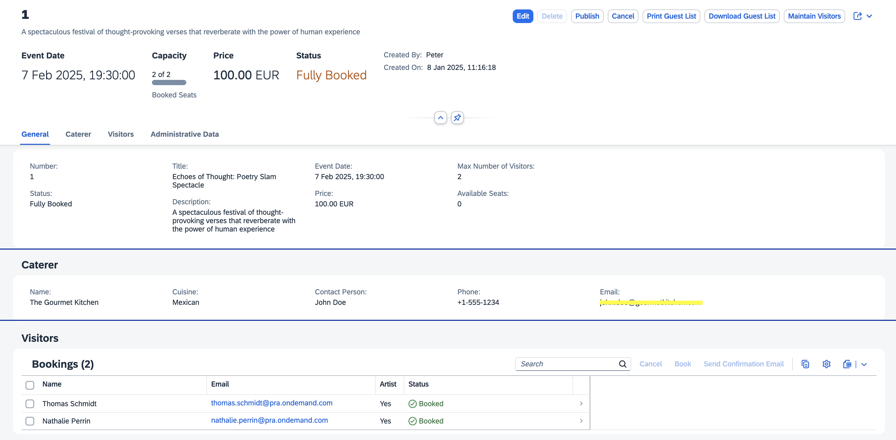
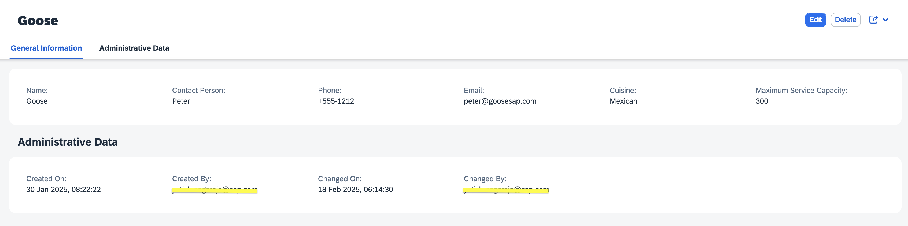

# A Guided Tour to Explore the Capabilities of the Sample Application

This guided tour showcases how the custom *Caterer* UI integrates with the core *Poetry Slam Manager (PSM)* application, enabling you to efficiently manage catering services for your poetry slams. Now that you have successfully built and deployed the *Caterer* extension, let's dive in and experience its functionality in action.

1. Launch your Poetry Slam Manager application directly from your subscriber subaccount.

    i. In the SAP BTP cockpit of the subscriber subaccount, navigate to *Instances and Subscription* under *Services*.

    ii. Choose the Poetry Slam Manager application from the *Application* table.

2. Select one of the poetry slams to see its details.

    > Note: If you don't have any poetry slams, choose `Generate Sample Data` and refresh the list. This action creates sample data for mutable entities, including poetry slams, visitors, and visits.

3. You can see that the new *Caterer* section is available. Choose *Edit*, select a caterer for your event from the predefined list you uploaded using a CSV file, and save your changes.

    > Note: Upon selecting a caterer, details such as cuisine, contact information, and other relevant specifics will be shown.

    

4. Now, let's add a new caterer using the *SAP Fiori Caterer* application. This functionality is maintained separately, as a caterer is created once and can then be assigned to poetry slam events within the PSM application. Typically, this task would be performed by a manager responsible for registering and managing caterers. To get started, launch the Caterer application.

    i. In the SAP BTP cockpit of the subscriber subaccount, navigate to *HTML5 Applications* under *HTML5*.

    ii. Choose the Caterer application from the *Application* table.

5. A list of existing caterers is displayed in the table. Choose *Create* and enter the following details:

    i. *Name*: *Goose*

    ii. *Contact Person*: *Peter*

    iii. *Phone*: *+555-1212*

    iv. *Email*: *peter@goosesap.com*

    v. *Cuisine*: *Mexican*

    vi. *Maximum Service Capacity*: *300*

6. Choose *Create* to add a new caterer.

    

7. Launch the Poetry Slam Manager application again and select one of the poetry slams.

8. Choose *Edit*, then click on the *Caterer Name* value list. Click *Go* to refresh the caterer list, ensuring that the newly created caterer is visible. Next, select *The Sheraton* as the caterer for your event and save your changes.

You’ve successfully added a new caterer using the custom *Caterer UI* and assigned them to a poetry slam, showcasing the seamless integration enabled by SAP BTP’s extensibility framework. This approach allows you to tailor solutions to specific customer needs while preserving the stability and integrity of the core PSM application. You can now explore additional customization options within your extension application to further tailor the experience and enhance functionality to meet specific requirements.
