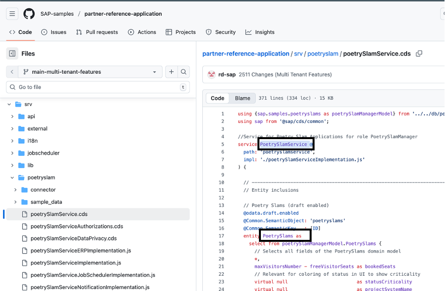
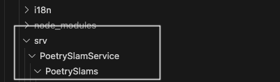
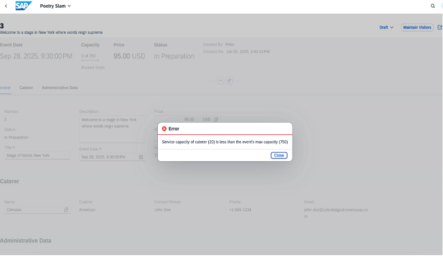

# Validate Data Between Extensible Requirements and the Base Application

This tutorial demonstrates how to implement data validation logic that validates data across extension requirements and the base application. The validation ensures data consistency and enforces business rules when extension entities interact with base application data.

The `@sap/cds-oyster` npm package includes two main components: the runtime component for application deployment and execution, and the SDK for local development and advanced scenarios like creating custom shells for the code sandbox. The plugin handles dependency management automatically. Let's explore how to implement data validation for our specific use case.

Once the [prerequisites](./06-BusinessLogicExtensibility.md#prerequisites-to-enable-business-logic-extensibility) for enabling business logic extensibility are completed for the base and extension application, follow the steps below to validate data between extensile requirements and the base application.

1. In an existing extension project, you can create code extensions within the `srv` folder by following a strict naming convention. Use the service name as the top-level folder and service entity name as second-level folder. The image below shows the highlighted service name `PoetrySlamService`, which is the top-level folder that corresponds to the service. The  `PoetrySlams` subfolder corresponds to the entity.
   
   The highlighted sections in the image below

   

   become the folder structure as shown below:

   

2. For custom event handlers, the filename must follow the format of `WHEN-dash-WHAT.js`. For example, a valid file should be created with path and name as `srv/PoetrySlamService/PoetrySlams/before-UPDATE.js`. Every event handler should follow the same pattern of exporting exactly one callable async function to the outside world.
The [event handler scope](https://www.npmjs.com/package/@sap/cds-oyster#event-handler-scope) provides an overview of how to define events in business logic extensibility. It illustrates the execution flow and how the system processes requests.
   
3. Implement the validation logic for the base and extension application by referring to [before-UPDATE](../partner-reference-extension-catering/srv/PoetrySlamService/PoetrySlams/before-UPDATE.js). In this case, the logic is implemented for the before-update clause.

> [!CAUTION]
> The latest version of the base application must be available in the `.base` folder before you deploy the extension application.
4. Deploy the extension application using the specified [guidelines](./02-DataModelExtensibility.md#deploying-the-extension).

5. To test the application, configure the **Caterer** extension app with a lower serving capacity and set a higher maximum number of visitors for the event. When executing this scenario, an error message is displayed while saving the event.

   For example, if the caterer’s serving capacity is set to 20 while the event allows a maximum of 75 visitors, the caterer can't serve all guests. Consequently, the system displays a validation error message, confirming that the validation logic is working as expected.

   

## Testing

### Unit Testing for Poetry Slam Service: Before-Update Validation

This section describes the step-by-step approach for creating and understanding a [unit test](../partner-reference-extension-catering/test/srv/PoetrySlamService/PoetrySlams/before-UPDATE.test.js) that validates the logic within a service handling update operation on poetry slams. The focus is on testing the capacity constraints of catering services in the **Poetry Slam** application.

### Understand the Environment

- **Handler:** The test involves the `before-UPDATE.js` handler. This is the business logic that handles operations that should occur before updating a poetry slam entry.
- **Global Mocking:** The global `SELECT` method is mocked to simulate a database query, specifically retrieving caterer data based on the given IDs.

### Setup for Tests

Each test scenario is set up using `beforeEach()`:

- **Mock Database Interaction:** The test mocks a database response using `whereMock` to simulate different conditions on caterer's service capacity.
- **Request Object:** A mock `req` object is constructed, representing a typical request to update a poetry slam. It contains the `x_caterer_ID` and `maxVisitorsNumber`.
- **Error Handling Mock:** `req.error` is a Jest mock function that simulates error handling paths during the tests.

### Cleaning Up

After each test case, the `afterEach()` cleanup function is used:

- **Global Deletion:** This deletes any global mocks and clears all Jest mocks to ensure no state leaks between tests.

### Test Cases
Two test cases are performed:

#### 1. Insufficient Capacity

- **Scenario:** The caterer's service capacity is less than the event's `maxVisitorsNumber`.
- **Expectation:** The `req.error` method is called with a 422 error and an appropriate error message indicating the capacity disparity.

#### 2. Sufficient Capacity

- **Scenario:** The caterer's capacity can handle the event's attendee number.
- **Expectation:** The `req.error` method isn't called, which indicates a valid capacity.

### Conclusion

These tests ensure that the business logic correctly validates caterer capacity against the expected number of visitors, preventing overbooking and ensuring service quality.

By following these steps, developers can ensure robust validation logic in their update operations, keeping potential bugs at bay and improving application reliability.
