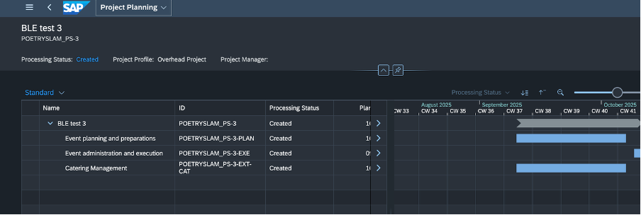
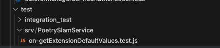

# Custom Logic at Base Application Extension Points

For the `@sap/cds-oyster` npm package, the runtime component is essential for deploying and running your application. The SDK is primarily used for local development or advanced scenarios, such as creating a custom shell for the code sandbox. The plugin manages these dependencies automatically. Now, let's explore how to implement custom logic at extension points for our use case.

Once the [prerequisites](./06-BusinessLogicExtensibility.md#prerequisites-to-enable-business-logic-extensibility) for enabling business logic extensibility are completed for the base and extension application, follow the steps below to write custom Logic at base application extension points.

## Adoption Required at the Base Application
For detailed instructions on adopting business logic extensibility in the base application, refer to [Enable Business Logic Extensions](https://github.com/SAP-samples/partner-reference-application/blob/main/Tutorials/50a-Multi-Tenancy-Features-Tenant-BusinessLogicExtensibility.md).

## Adoption in the Extension Application

1. In an existing extension project, you can create code extensions within the `srv` folder by following a strict naming convention. Use the service name as the top-level folder and service entity name as second-level folder. The image below shows the highlighted service name `PoetrySlamService`, which is the top-level folder that corresponds to the service.

The highlighted sections in the image below
 
   

become the folder structure as shown below:

   

   
2. For custom exit implementation, the filename must follow the format of `WHEN-dash-CustomExit.js`. For example, a valid file should be created with path and name as `srv/PoetrySlamService/PoetrySlams/on-extendProjectData.js`. Every event handler should follow the same pattern of exporting exactly one callable async function to the outside world. The [event handler scope](https://www.npmjs.com/package/@sap/cds-oyster#event-handler-scope) provides an overview of how to define events inbBusiness logic extensibility. It illustrates the execution flow and how the system processes requests. 

3. Implement the custom exit logic by referring to [on-extendProjectData](../partner-reference-extension-catering/srv/PoetrySlamService/on-extendProjectData.js). This adds an additional task in the SAP S/4HANA Cloud Public Edition project created at the base application.

> [!CAUTION]
> The latest version of the base application must be available in the `.base` folder before you deploy the extension application.
4. Deploy the extension application using the specified [guidelines](./02-DataModelExtensibility.md#deploying-the-extension).
5. To test the application, choose **Create Project** and select the **Project ID** in the created event. The new task appears in the SAP S/4HANA Cloud Public Edition system as shown below:
      
      ​​<p align="center">  
      
      </p>

## Testing

### Unit Testing for Custom Exits in the Poetry Slam Service

Unit tests are crucial for ensuring that each piece of business logic functions as expected and prevents regressions when extensibility features are added. These tests are vital for maintaining application stability and confidence during continuous development and deployment.

### Creating Unit Tests for Custom Exits

To create unit tests for custom exits, follow these steps:

1. **Organize Your Tests**: In your extension project, custom exit unit tests should be organized within the `srv` folder under the `test` directory. Use a strict naming convention, where the service name is the top-level folder, and the custom exit implementation file is nested beneath it.
   ​<p align="center">  
      
   </p>

2. **Unit Test Implementation**: The tests are implemented using the Chai library for assertions. The focus is on verifying that custom logic within the service behaves as expected under various conditions.


This [unit test](../partner-reference-extension-catering/test/srv/PoetrySlamService/on-extendProjectData.test.js) file contains unit tests for the `on-extendProjectData` custom exit in the **Poetry Slam** Service. The tests ensure that the additional task creation from extension code at the SAP S/4HANA Cloud Public Edition project is successfully created.

### Test Scenarios

This test file contains several Jest-based test cases designed to cover different aspects of the project data extension process:

1. **Adding New Extension Element**:
   - **Purpose**: Confirms that the handler can add a new extension element to a given project record.
   - **Approach**: Tests if the function processes a mock request containing valid project data, then checks for the inclusion and correctness of a new element in the results.

2. **Handling Empty Base Application Tasks**:
   - **Purpose**: Ensures extension tasks are added correctly even when the base task data is empty.
   - **Approach**: Validates that the extension element is added with the correct data using today's date for the `PlannedStartDate`.

3. **Invalid JSON Handling**:
   - **Purpose**: Tests the function's robustness when encountering invalid JSON within the project data.
   - **Approach**: Ensures an error is thrown with the expected status and message.

4. **Null `Project` Handling**:
   - **Purpose**: Verifies graceful error handling when project data is null.
   - **Approach**: Similar to the invalid JSON test, it ensures an appropriate error message and status.

5. **Handling Large Data Sets**:
   - **Purpose**: Checks the function's performance and stability when dealing with excessive data entries.
   - **Approach**: Confirms that the handler can efficiently process a very large number of elements without failing.

## Testing Framework

The tests use the **Jest** framework, which provides an efficient and scalable environment for testing JavaScript/Node.js applications. Test functions use Jest's `expect` assertions to validate the outcomes:

- **Asynchronous**: `async/await` is used to manage asynchronous operations.
- **Error Handling**: Jest's `.rejects` method is used to test error conditions.
- **Assertions**: Tests use `expect` methods to verify the correctness of the processed data and error messages.

## Set Up and Run Tests

To run the tests, run the following command:

```bash
cd partner-reference-extension-catering
npm run test:unit
```

This command executes the unit tests located in the `test/srv` directory by using Jest for all JS-based testing.

### Conclusion

The `on-extendProjectData.test.js` file provides a robust suite of tests that enhance the reliability and stability of the `PoetrySlamService` module. The tests ensure that the module accurately processes project data and handles invalid inputs and large volumes efficiently.

These tests verify that the custom exit handler correctly processes extensions for project data, handling edge cases and maintaining robust operation across various input scenarios. By following these steps, developers can create reliable unit tests that enhance the extensibility of their applications.
